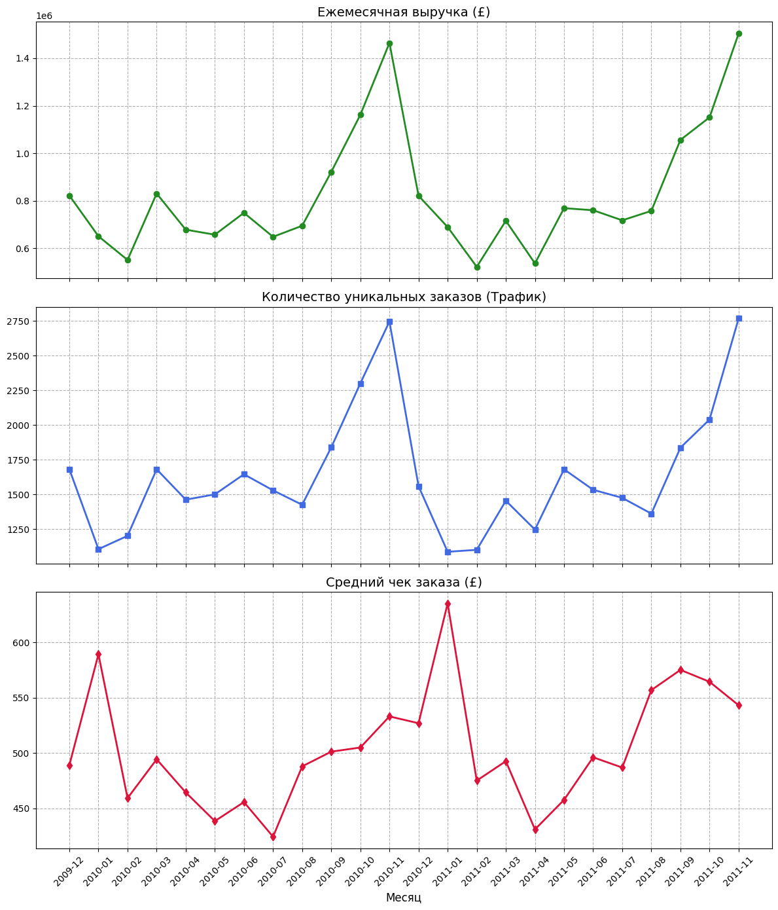
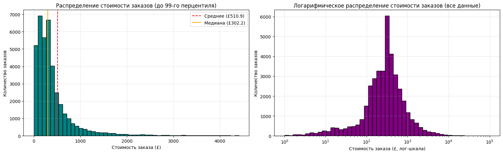
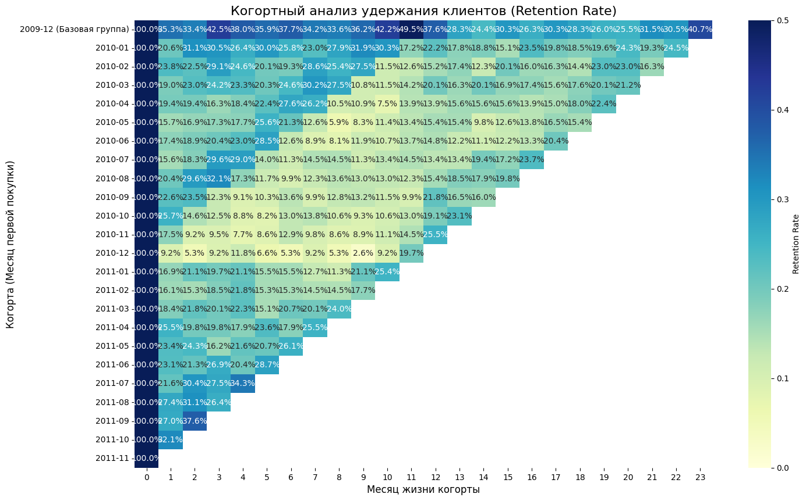

# Анализ продаж онлайн-ретейлера

Исследовательский анализ ~1 млн транзакций британского онлайн-магазина подарков и товаров для дома (2009–2011): динамика выручки, структура ассортимента, сегментация клиентов, удержание и проверка гипотезы.

**Стек:** Python, pandas, numpy, matplotlib, seaborn, scipy, Jupyter Notebook

## Данные

[Online Retail II](https://archive.ics.uci.edu/dataset/502/online+retail+ii) (UCI Machine Learning Repository): 1 067 371 строка, период 01.12.2009 – 09.12.2011. Поля: номер счёта, код и описание товара, количество, дата, цена, ID клиента, страна.

Датасет в репозиторий не включён — скачайте `online_retail_II.xlsx` и положите рядом с ноутбуком.

## Ключевые результаты

| Вопрос | Результат |
| --- | --- |
| Что двигает выручку в сезон? | Число заказов: в ноябре 2010 их в 2,5 раза больше, чем в январе, а средний чек держится в коридоре £420–640 |
| Насколько выручка сконцентрирована? | Топ-20% товаров дают 78,7% выручки; заказы дороже £1 009 (8,9% чеков) — 45,6% выручки |
| Кто приносит деньги? | RFM: сегмент «Champions» — 17% клиентов и 62% выручки |
| Как удерживаются новые клиенты? | Retention новых когорт — 15–22% на 1-й месяц и 12–18% на 3-й |
| Отличается ли чек по дням недели? | Медианный чек в будни на 11,8% выше, чем в воскресенье (Манна–Уитни, p < 0,001) |

## Что сделано

1. **Очистка данных.** Удалены дубликаты, возвраты (счета на `C`, 6,7% оборота) вынесены отдельно, исключены служебные позиции (доставка, ручные корректировки). Строки без ID клиента (23%) оставлены для анализа выручки и исключены для RFM и когорт.
2. **Выручка = трафик × средний чек.** Помесячная декомпозиция показала, что сезонный рост выручки обеспечивает число заказов, а не размер корзины. Неполный декабрь 2011 исключён.
3. **Товары и страны.** Топы по выручке и по количеству пересекаются на 6 позиций из 10; Великобритания даёт 85% выручки.
4. **Распределение чеков.** Сильная правая асимметрия (среднее £511 против медианы £302) — признак значимой доли оптовых заказов.
5. **RFM-сегментация** по терцилям с выделением сегментов Champions, At Risk и New Customers.
6. **Когортный анализ.** Учтено левое цензурирование: когорта 2009-12 включает клиентов, покупавших до начала данных, и не сравнивается с остальными.
7. **Проверка гипотезы.** В данных почти нет суббот (400 строк из 1 млн), поэтому будни сравнивались с воскресеньем. Выбран критерий Манна–Уитни из-за тяжёлого хвоста распределения; помимо p-value оценена величина эффекта.

## Графики

**Выручка, число заказов и средний чек по месяцам**



**Распределение стоимости заказов**



**Удержание клиентов по когортам**



## Ограничения

- Данные одного магазина с большой долей оптовых клиентов; выводы о B2B/B2C-поведении — гипотезы, а не подтверждённые факты.
- RFM построен на терцилях — простая, но грубая сегментация.
- Различие чеков по дням недели статистически значимо, но причинно-следственная связь не проверялась.

## Как запустить

```bash
pip install -r requirements.txt
jupyter notebook retail_analysis.ipynb
```
